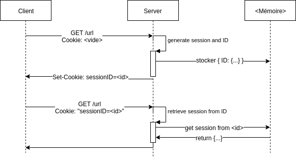
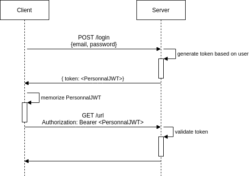

# Authentification

_Login_, identification, connexion et autre _authentication_

---

## C'est quoi déjà ?

---

### HTTP en gros

- Le client demande, le serveur répond

_Le client demande ce qu'il veut, même l'addition du gars d'à côté ?_

- Pour des données sensibles le serveur voudra savoir qui l'interroge, le plus souvent le client donnera un identifiant et un mot de passe, il s'**authentifie**

```js
// requête http avec identifiant et mot de passe avec axios
axios.post('http://localhost:3001/login', {
    email: state.email,
    password: state.password,
});
```

---

### Redemander des choses

- Il faut redonner l'identifiant et le mot de passe à chaque fois ?

---

### La session



---

### Oui... Mais

- En cross origin (l'api sur 1 domaine, le front sur 1 autre), gérer une session nécessite quelques adaptations
- C'est faisable, mais il existe une autre solution adaptée...

---

## JWT

### Le principe

Les JWT (JSON Web Token) vont être un moyen de mémoriser notre identité, nous permettant par la suite de demander au serveur de nous autoriser l'accès à certaines ressources.

Il s'agit d'un objet JSON qui nous sera attribué par le serveur après authentification. Il sera signé pour vérifier son intégrité.

Le client s'occupera de le garder et de le renvoyer à chaque demande pour prouver son identité et ainsi obtenir l'accès à telle ou telle ressource.

---

### Un petit schéma ?



---

### Ou l'allégorie du concert ?

- Toto (le client) va au concert de Dorothée, c'est un fan VIP

- Il donne son nom et prénom (authentification) au guichet (serveur), on lui donne un bracelet vert (son token) lui donnant droit au concert et aux coulisses

- Il met son bracelet autour de son poignet (c'est au client de mémoriser son JWT)

- Plus tard, il demande accès aux coulisses et présente simplement son bracelet, il est autorisé à passer 🎉

---

### Compris ?

[Alors un peu de lecture pour plus de précisions](https://jwt.io/introduction/)

---

## Et la sécurité là-dedans ?

- On va mettre dans le JWT un moyen de reconnaître l'utilisateur, par exemple son ID

- Puisque le JWT possède une signature dépendant de son contenu, côté serveur on pourra vérifier qu'il n'a pas été modifié

- Ainsi nos utilisateurs ne peuvent pas prétendre être quelqu'un d'autre

A priori tout va bien, il convient tout de même de **comprendre** quelques bonnes pratiques

---

### Prendre ses précautions lors de la mémorisation du JWT côté client

3 possibilités

1. Stocker le JWT uniquement dans le state (React): simple et efficace mais il faut se reconnecter si on actualise la page
2. Stocker le JWT en localStorage : on conserve en mémoire le JWT
[LocalStorage](https://developer.mozilla.org/fr/docs/Web/API/Window/localStorage) est un moyen simple de mémoriser dans le navigateur certaines données pour un site web donné.

---

Ces données sont accessibles via les scripts Javascript du domaine.

Comme pour toute donnée en mémoire côté client (_donc comme pour la solution 1_), si des failles [XSS](https://owasp.org/www-community/attacks/xss/) sont présentes sur notre application, les données du localStorage sont compromises  
(_comme les mots de passe saisis via un formulaire par exemple_).

---

3. Stocker le JWT dans un cookie : on conserve en mémoire le JWT même si on actualise, sécurisé sous certaines conditions

- On doit utiliser l'option `HttpOnly` lors de la création du cookie pour le rendre inaccessible via les scripts
- On doit mettre en place des jetons de protections contre les [CSRF](https://cheatsheetseries.owasp.org/cheatsheets/Cross-Site_Request_Forgery_Prevention_Cheat_Sheet.html#csrf)

Cette solution est cool, mais plus compliquée que la première à mettre en place.

[Un bon article expliquant comment faire](https://medium.com/@ryanchenkie_40935/react-authentication-how-to-store-jwt-in-a-cookie-346519310e81)

---

### Utiliser HTTPS en production

HTTPS vise à protéger la confidentialité des données échangées entre le client et le serveur
- [Plus de détails](https://support.google.com/webmasters/answer/6073543?hl=fr)
- [En images](https://howhttps.works/)
- [Un outil pratique pour le mettre en place : Certbot](https://certbot.eff.org/)

_De manière générale, pour n'importe quel système d'authentification où l'on échange des données sensibles, on doit sécuriser les communications client/serveur en production_
