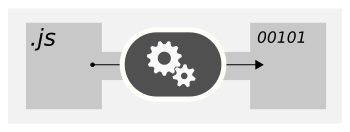
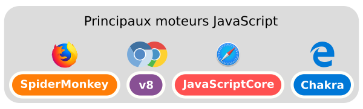
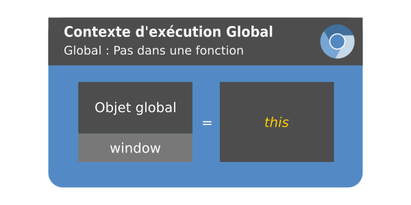
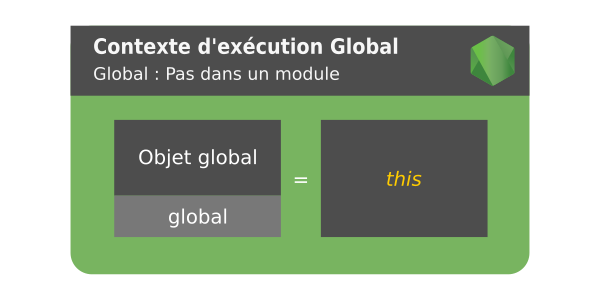

# NodeJS & Express

## NodeJS

[NodeJS](https://nodejs.org/) est un _runtime_ javascript.

Un _runtime_ est un environnement d'exécution. C'est à dire un couple constitué d'un **moteur** et d'un **contexte global**.

### Moteur

Le programme qui lit le code, et le transforme en instructions qu'il transmet à la machine (processeurs, RAM, disques, ...)



Pour javascript, c'est un interpréteur (= lit et exécute le code à la vollée, sans compilation).

Il existe de nombreux moteurs javascript. Node utilise "V8", un moteur créé par Google, et présent dans Chrome (et tous ses dérivés Chromium, Brave, Vivaldi, ...)



### Contexte global

On pourrait définir le contexte global comme le bac à sable dans lequel on va jouer : même si c'est toujours du sable, il n'y aura pas toujours les même jouets à disposition !

### contexte navigateur



L'objet global s'appelle `window`. Il contient des fonctions pour interagir avec l'utilisateur (`alert`, `prompt`, `confirm`...) ou avec le navigateur lui-même (`history`, `location`, ...), mais aussi le DOM (`window.document` !)

### contexte Node



L'objet global s'appelle `global`. Il contient des informations sur le processus Node (`global.process`) ainsi que la fonction `require` qui permet d'importer d'autres fonctionnalités (cf. [modules](./modules.md))

### Les outils communs

Fort heureusement, il y a quelques outils qu'on peut trouver partout ! notamment :

- `console`, pour afficher des infos dans la console.
- `setTimeout`, pour déclencher une fonction après un temps d'attente (et `clearTimeout` pour l'annuler).
- `setInterval`, pour déclencher une fonction de manière récurente (et `clearInterval` pour arrêter la répétition).
- mais aussi tous les objets natifs de Javascript : `Math`, `JSON`, `Promise`, ...

### Node, à quoi ça sert ?

Concrétement, à faire du JS partout. Oui, partout !

- Applications en LDC
- Serveurs Web
- Applications en "client lourd" (Electron)
- Objets connectés (Nodebots, Tessel 2,...)

### Comment ça marche ?

- Le même JavaScript que dans un navigateur (ouf!)
- Mais un nouveau contexte à prendre en main.

---

## Express

[ExpressJS](https://expressjs.com/) est une librairie qui vous permettra de créer une application Web plus simplement.
Elle fournit un ensemble de méthode permettant de traiter les requêtes HTTP et fournit un système de middleware pour étendre ses fonctionnalitées.

### Comment ça marche ?

Comment on fait avec toutes nouvelles librairie ? On va voir la doc ! Alors allons voir la doc 🔗 https://expressjs.com/fr/starter/hello-world.html Et là on voit quoi ? Un exemple ! Commentons le !

```js
// On créer une application express
const express = require('express');
const app = express();

// On crée une route : GET /
// Lorsque le serveur reçoit une requête GET sur l'url "/", on execute la callback en second argument
// Cette callback a 2 params : la requête HTTP & la réponse renvoyé
// https://expressjs.com/fr/4x/api.html#req
// https://expressjs.com/fr/4x/api.html#res
app.get('/', function (req, res) {
  res.send('Hello World!')
});

// On met notre application serveur en écoute sur le port 3000
app.listen(3000, function () {
  console.log('Example app listening on port 3000!')
});
```

Bon c'est pas mal pour un début ! Eet si on allait pratiquer tout ça dans notre projet de todolist ? :wink:
